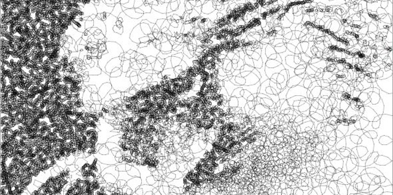
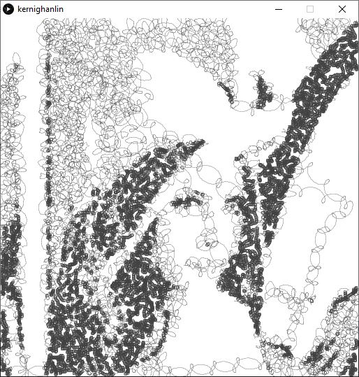
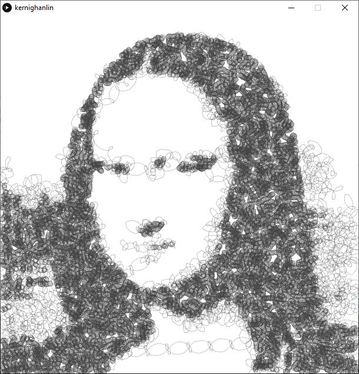
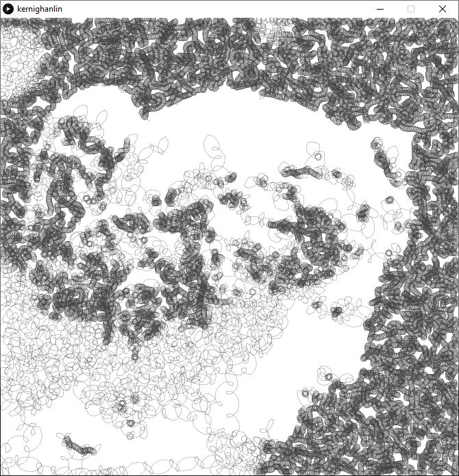
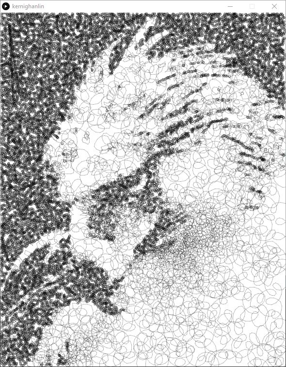
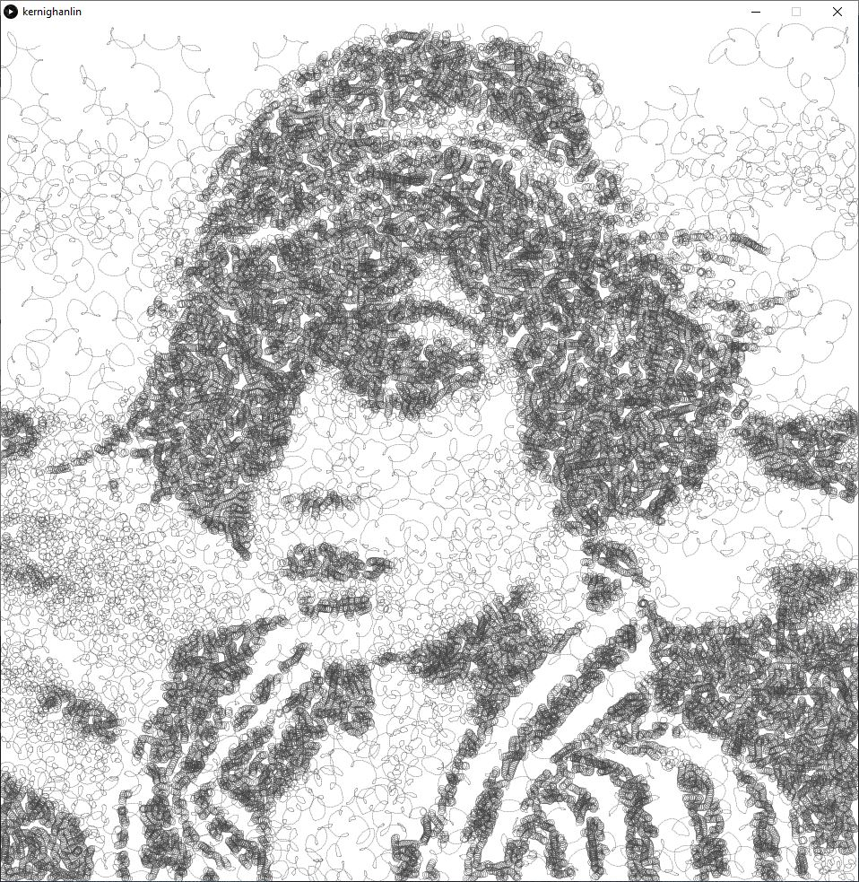

# Chiu Et Al 2015

Implementation of [Chiu Et Al 2015](http://cgv.cs.nthu.edu.tw/projects/Recreational_Graphics/CircularScribbleArt)
written for Processing.

## Usage

Install Processing from http://processing.org
Open the chiuEtAl2015.pde file with the Processing app.
Run (the play button) and watch as it create the drawing.

## Note

Some intermediate files are generated to process an image.  
These text files save each step of the work so that you can tweak the last step without waiting for all the earlier steps.  That means if you want to change the earlier steps you have to delete the text files.
These files are:
- kMeansClusters.txt,
- kMeansPoints.txt, 
- wangTiles.txt, and
- kernighanLin.txt

Every time you choose a new image you will have to delete these intermediates.

## Next

Adjust parameters in setup() to see different effects.

At the top of setup() you will see

    size(512,512);
    img = loadImage("lenna.png");

size(w,h) will open a window w wide and h high.  it does not have to match your image size.  Your image file goes instead of lenna.png.

    writeGCode = new WriteGCode("output.ngc");

Change "output.ngc" to the destination for your gcode file.

    wangTiles = new WangTiles(40000);

40000 is the approximate number of points that will be put across the image.  Larger images need more points to be accurately represented.

`adjustTone()`  adjusts the tone of the image for better representation in a black and white medium.

    scribbler = new CircularScribbler(20,10,3,2.5,0.2);

- 20 is the number of segments per loop, in degrees.  as this number goes up the quality goes down, but so does the size of the output file.
- 10,3 control the max/min size of the loops.  lighter areas, bigger loops.
- 2.5,0.2 are the max/min speed of the loops.  lighter areas, faster loops.

If the picture gets bigger and the loop sizes are not changed then the loops will appear smaller.

Experiment with these numbers to get a good feel, and please share your results!

## Legal

Wang Tiles (and tileset.dat) are from https://johanneskopf.de/publications/blue_noise/
Read the paper, it's excellent!

## Todo

- output results to JPG, SVG?
- tweakable parameters while running?

## Early gallery results

