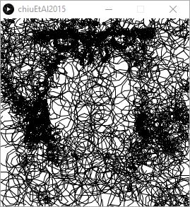

# chiuEtAl2015

Implementation of http://cgv.cs.nthu.edu.tw/projects/Recreational_Graphics/CircularScribbleArt
Written for Processing

## Usage

Install Processing from http://processing.org
Open the chiuEtAl2015.pde file with the Processing app.
Run (the play button) and watch as it create the drawing.

## Note

Every time the app runs it will create some text files in the folder where it is run.
These text files save each step of the work so that you can tweak the last step without waiting for all the earlier steps.  That means if you want to change the earlier steps you have to delete the text files.

## Next
Adjust parameters in setup() to see different effects.

At the top of setup() you will see

    size(512,512);  img = loadImage("lenna.png");

Change the size values to match the size of your image file and "lenna.png" to your image file.

    writeGCode = new WriteGCode("output.ngc");

Change "output.ngc" to the destination for your gcode file.

    wangTiles = new WangTiles(10000);

Is a good starting number.  Later you can raise this.  In very large images in the original paper it went as high as 100k.
Start low to try many variations.

    scribbler = new CircularScribbler(20,10,3,2.5,0.2);

20 is the number of segments per loop, in degrees.  the higher the number, the lower the quality.
10,3 control the max/min size of the loops.  lighter areas, bigger loops.
2.5,0.2 are the max/min speed of the loops.  lighter areas, faster loops.

Experiment with these numbers to get a good feel.

## Legal

Wang Tiles (and tileset.dat) are from https://johanneskopf.de/publications/blue_noise/
Read the paper, it's excellent!

## Todo

- output results to JPG, DXF?
- tweakable parameters while running?

## Early gallery results

